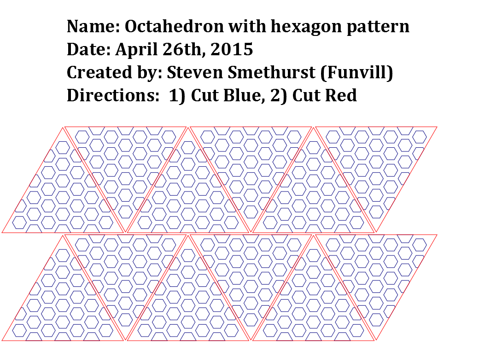
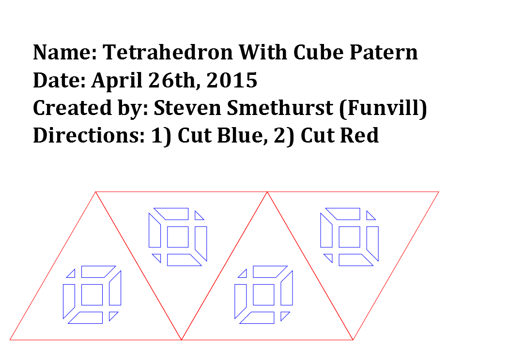

# LaserLanterns
A bunch of laser cut lanterns of [Platonic Solids](https://en.wikipedia.org/wiki/Platonic_solid)

I'm trying for a uniform size for all the objects. These objects have no connecter tabs or slots that need to be an exact size. So you should be able to scale these objects to any size. 

### Octahedron
Each triangle is 10cm wide. 

### Tetrahedron
Each triangle is 10cm wide. 

